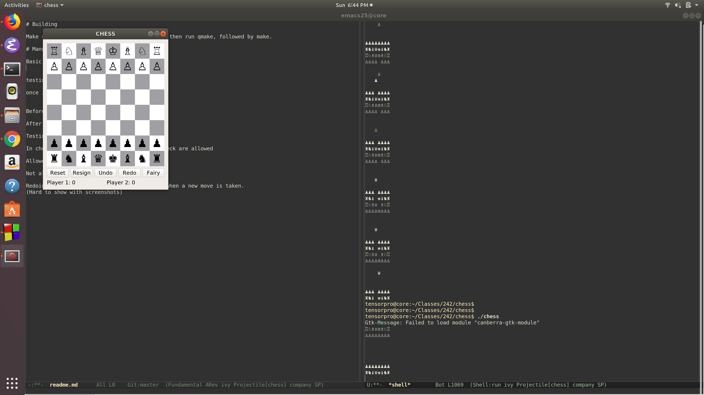
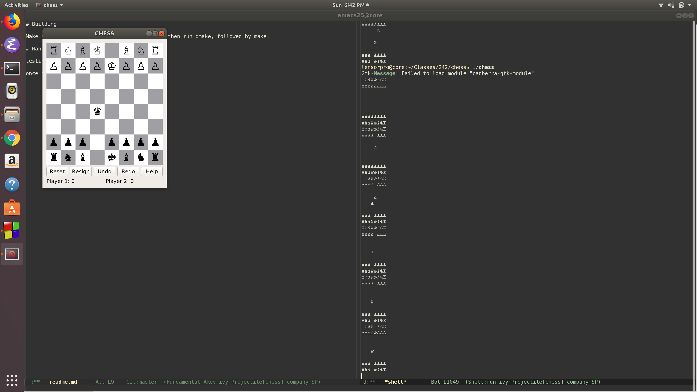
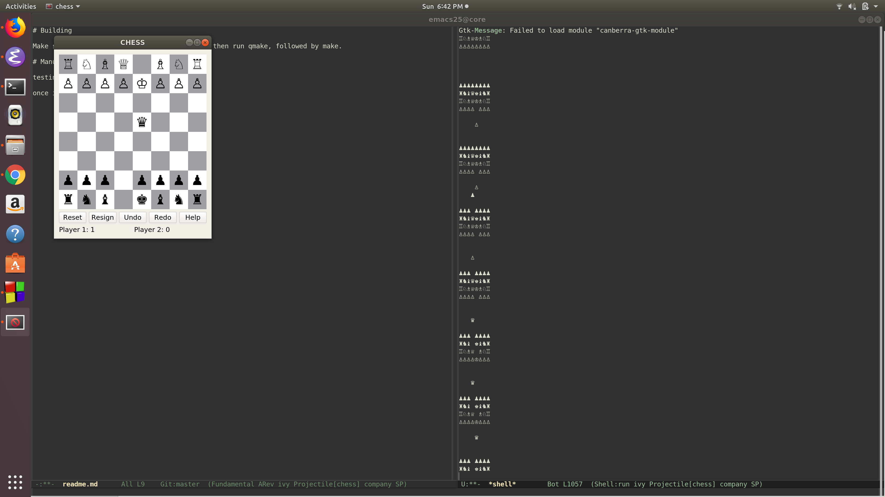
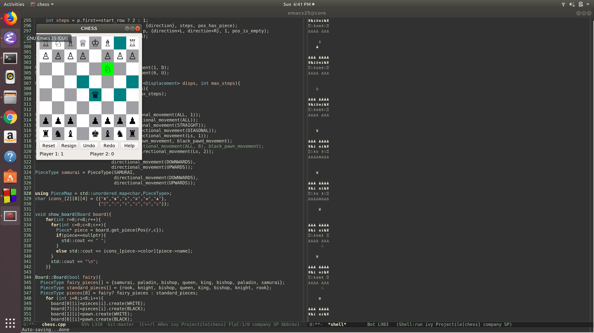
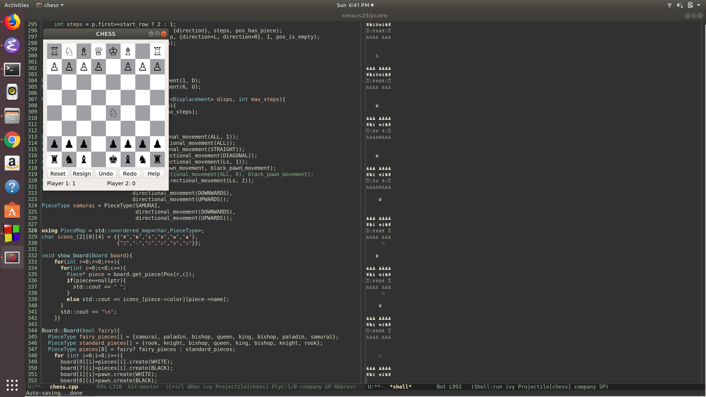
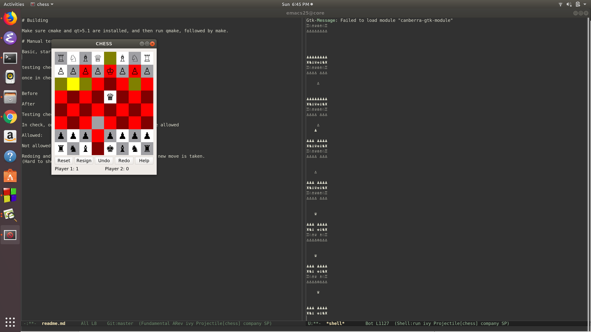

# Building

Make sure cmake and qt>5.1 are installed, and then run qmake, followed by make.

# Manual test plan

Basic, start screen looks right

testing checkmate

once in checkmate, the score goes up.

Testing check
In check, only moves that take king out of check are allowed

Optional help:

